# Práctica 1 - ETL de vuelos

Proyecto de ETL en Python con un modelo multidimensional en SQL Server.

## Nombre del dataset

Para esta actividad se utilizó el archivo `dataset_vuelos_crudo.csv`, el cual contiene 10,000 registros de clientes. Entre sus variables se encuentran el identificador y nombre de aerolinea, género del pasajero, fecha de vuelo, gasto, etc.

## Objetivo

Preparar y mejorar la calidad del dataset mediante Python y la biblioteca Pandas, aplicando técnicas de diagnóstico, tratamiento de valores faltantes, estandarización de datos y eliminación de registros duplicados. El resultado del proceso se almacena en el archivo `dataset_vuelos_limpio.csv`.

## Modelo y carga

La parte de modelo y carga incluye:

- modelo estrella para los registros de vuelos;
- dimensiones de fecha, aerolínea, aeropuerto, pasajero, vuelo, estado y venta;
- tabla de hechos `FactVuelo`;
- historial Tipo 2 en `DimPasajero`;
- claves primarias, claves foráneas e índices;
- carga desde Python sin duplicar registros;
- ejecución de SQL Server y del ETL con Docker Compose;
- diagrama del modelo en `docs/diagrama_modelo.md`.

## Ejecución

Con Docker Desktop abierto, ejecutar desde esta carpeta:

```bash
docker compose up -d
```

Para revisar el resultado:

```bash
docker compose logs etl
```

La carga correcta finaliza con 10,000 registros verificados. El contenedor `etl` termina con código `0` y SQL Server permanece en ejecución.

## Conexión

```text
Servidor: localhost,1433
Base de datos: VuelosDW
Usuario: sa
Contraseña: Practica1_G6_2026!
```

El script de creación se encuentra en `sql/create_database.sql` y la carga en `src/load.py`.

## Estructura de la práctica

```
PRACTICA1/
├── datos/                              #DATASET INPUT Y DATASET OUTPUT
│   ├── dataset_vuelos_crudo.csv
│   └── dataset_vuelos_limpio.csv
├── docs/                               #ARCHIVOS PARA DOCUMENTACIÓN
│   ├── diagrama_modelo.md
│   └── docker.md
├── sql/                                #SCRIPTS UTILIZADOS
│   ├── consultas_analiticas.sql
│   └── create_database.sql
├── src/                                #DESARROLLO CON PYTHON
│   ├── extract.py
│   ├── load.py
│   ├── main.py
│   └── transform.py
├── .env.example                        #VARIABLES DE ENTORNO EJEMPLO
├── docker-compose.yml                  #CONFIGURA Y EJECUTA CONTENEDORES
├── Dockerfile                          #DEFINE Y CONSTRUYE IMAGENES
├── requirements.txt                    #LISTA DEPENDENCIAS PYTHON
└── README.md                           #DOCUMENTACIÓN
```

## Descripción del proceso de limpieza aplicado

Antes de realizar la transformación, se trabaja sobre una copia del DataFrame original para evitar modificar directamente los datos de entrada. El proceso busca estandarizar los valores, convertir los campos al tipo de dato correspondiente, tratar valores faltantes y eliminar registros duplicados, con el objetivo de obtener un conjunto de datos más consistente para las etapas posteriores del proceso ETL.

El proceso de limpieza incluye las siguientes operaciones:

1. **Normalización de textos:** se eliminan los espacios al inicio y al final de los valores y las secuencias de múltiples espacios se reemplazan por un único espacio. Esta normalización se aplica a diferentes campos de texto para evitar inconsistencias causadas por espacios innecesarios.

2. **Estandarización de aerolíneas:** los códigos de las aerolíneas se convierten a mayúsculas, mientras que los nombres de las aerolíneas se convierten a formato de título. Esto permite mantener una representación uniforme de la información.

3. **Estandarización de aeropuertos:** los códigos de los aeropuertos de origen y destino se normalizan eliminando espacios innecesarios y convirtiendo todos los valores a mayúsculas.

4. **Estandarización del género:** los valores de género se normalizan eliminando espacios y convirtiéndolos a mayúsculas. Posteriormente, las distintas formas utilizadas para representar el género se unifican en las categorías `M` y `F`. Por ejemplo, `MALE` y `MASCULINO` se convierten en `M`, mientras que `FEMALE` y `FEMENINO` se convierten en `F`.

5. **Estandarización del estado del vuelo:** los valores de la columna de estado se normalizan eliminando espacios innecesarios y convirtiéndolos a mayúsculas, permitiendo que valores escritos con diferentes combinaciones de mayúsculas y minúsculas tengan una representación uniforme.

6. **Estandarización de la clase de cabina:** los valores de la clase de cabina se limpian y convierten a mayúsculas para mantener un formato homogéneo.

7. **Normalización de fechas:** las fechas y horas correspondientes a salida, llegada y reserva pueden encontrarse en diferentes formatos. El proceso intenta reconocer varios formatos de fecha y hora, entre ellos `DD/MM/AAAA HH:MM`, `MM-DD-AAAA HH:MM AM/PM`, `AAAA-MM-DD HH:MM:SS` y `AAAA-MM-DD HH:MM`. Los valores reconocidos correctamente se convierten al tipo de fecha y hora de Pandas. Los valores que no coinciden con ninguno de los formatos establecidos se convierten en valores nulos de tipo fecha.

8. **Normalización de precios:** los valores de la columna de precio del ticket se convierten a formato numérico. Para ello, se eliminan espacios, se reemplaza la coma por punto como separador decimal y se eliminan caracteres que no corresponden a valores numéricos. Los valores que no pueden convertirse correctamente se transforman en valores nulos. El precio estimado en dólares también se convierte a un tipo numérico, convirtiendo los valores no válidos en nulos.

9. **Conversión de campos numéricos:** las columnas relacionadas con duración del vuelo, retraso, edad del pasajero y cantidad de maletas se convierten a valores numéricos. Los datos que no pueden convertirse correctamente se consideran valores nulos.

10. **Tratamiento de valores nulos:** los valores faltantes de nacionalidad y canal de venta se reemplazan por `UNKNOWN`. Antes de realizar este reemplazo, los valores son normalizados para mantener un formato uniforme.

11. **Normalización de otros campos:** los métodos de pago y las monedas se limpian eliminando espacios innecesarios y convirtiendo los valores a mayúsculas.

12. **Eliminación de duplicados:** se identifican y eliminan las filas completamente duplicadas mediante `drop_duplicates()`. Antes de eliminarlos, se muestra en consola la cantidad de registros duplicados encontrados, permitiendo verificar el efecto de esta etapa sobre el conjunto de datos.

13. **Validación del proceso:** durante la transformación se registra la cantidad de registros existentes antes y después de la limpieza. Esto permite verificar si se produjo una reducción de registros como consecuencia de la eliminación de duplicados y facilita la comprobación del proceso.

## Justificación del modelo 

Para esta práctica se seleccionó el **modelo estrella** porque permite representar de forma clara y organizada la información relacionada con los vuelos. La tabla FactVuelo funciona como el centro del modelo y se relaciona directamente con las diferentes dimensiones, como fecha, aerolínea, aeropuerto, pasajero, vuelo, estado y detalles de venta. Además, contiene datos que pueden ser utilizados para realizar cálculos, como la duración, los retrasos, el precio de los tickets y la cantidad de maletas.

Este modelo es adecuado para la práctica porque facilita las consultas analíticas mediante operaciones como contar, agrupar, sumar y calcular promedios. De esta manera, se pueden analizar aspectos como el total de vuelos, vuelos por aerolínea, destinos, género, estados, retrasos y ventas de una forma más sencilla y organizada.

## Aplicación de una dimensión Tipo 2

Se aplicó **SCD Tipo 2** en `DimPasajero` para conservar el historial cuando la información de un pasajero cambia. Se eligió esta dimensión porque datos como la **edad o nacionalidad** pueden actualizarse con el tiempo, y es importante conservar tanto la información anterior como la nueva.

Para ello, `DimPasajero` utiliza `FechaInicio`, `FechaFin` y `EsActual`, permitiendo identificar qué versión de los datos estaba vigente en cada momento. Así, los registros históricos de los vuelos mantienen la información correspondiente al momento en que ocurrieron.


## Evidencia del proceso y capturas

#### Diagrama del modelo

<p style="text-align: center;">
  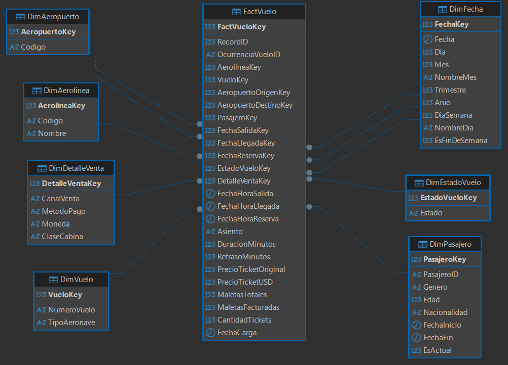
</p>

En la pantalla principal se puede apreciar la ejecución exitosa del proceso y los logs de nuestro dataset analizado
<p style="text-align: center;">
  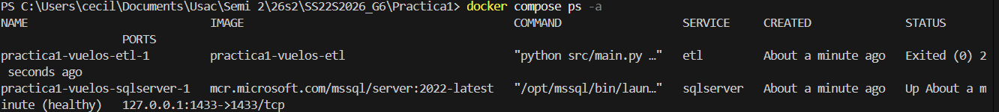
</p>
<p style="text-align: center;">
  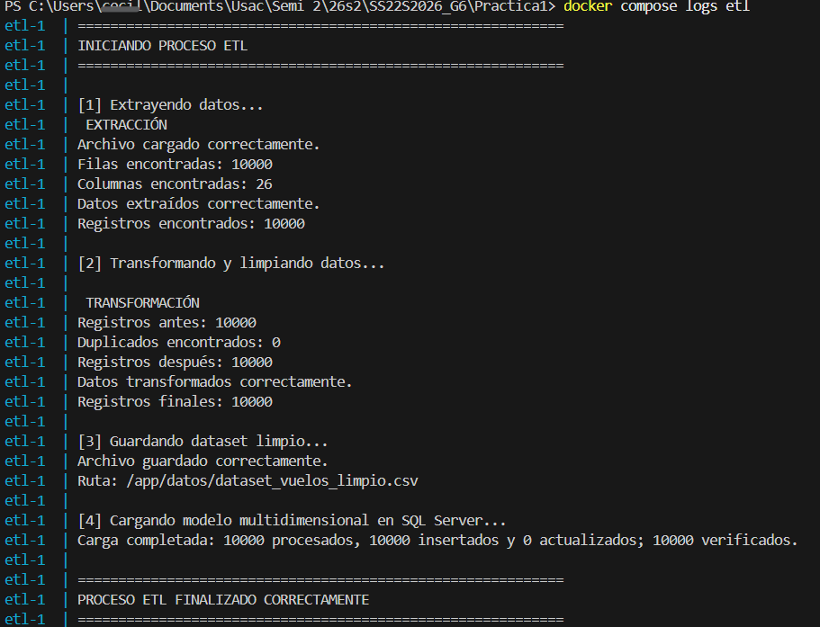
</p>

Acontinuación se muestra el resultado de las consultas realizadas, pensando en la relevancia que se puede tener para esta práctica: 

#### Consulta 1:
<p style="text-align: center;">
  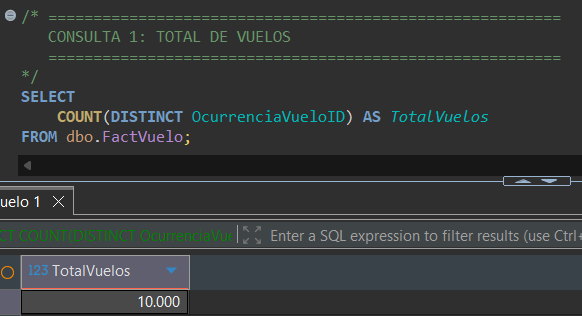
</p>

#### Consulta 2:
<p style="text-align: center;">
  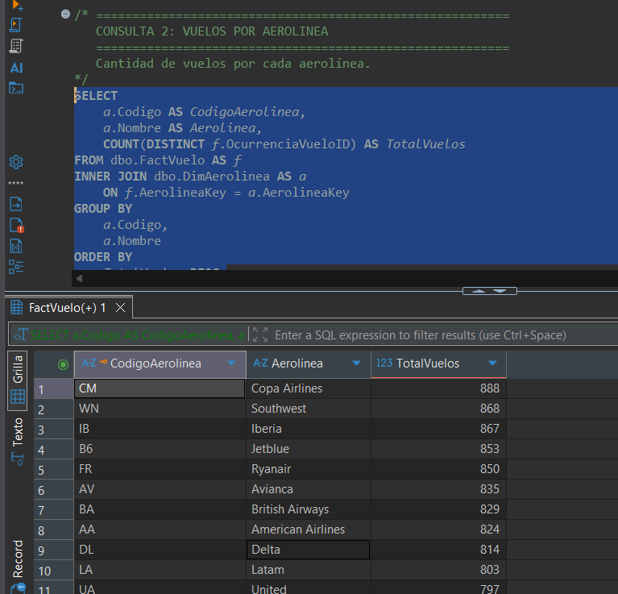
</p>

#### Consulta 3:
<p style="text-align: center;">
  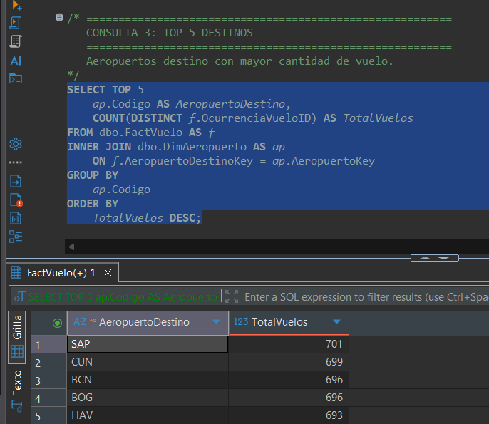
</p>

#### Consulta 4:
<p style="text-align: center;">
  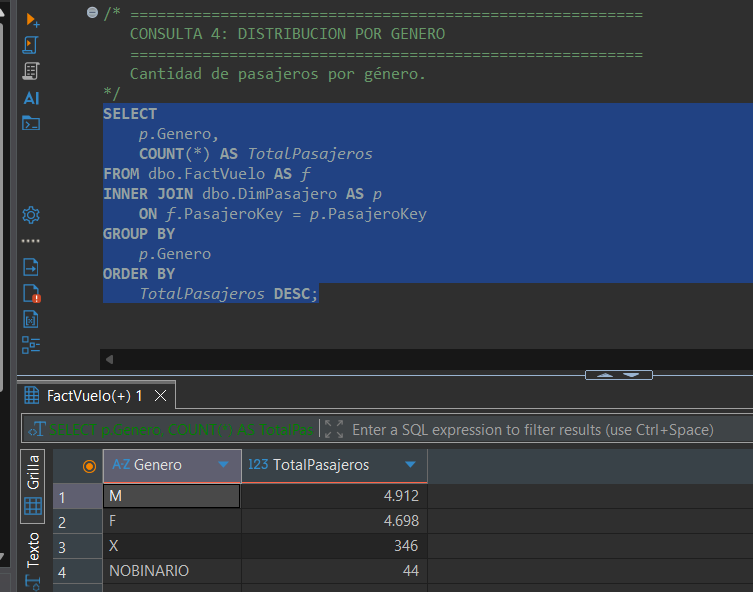
</p>

#### Consulta 5:
<p style="text-align: center;">
  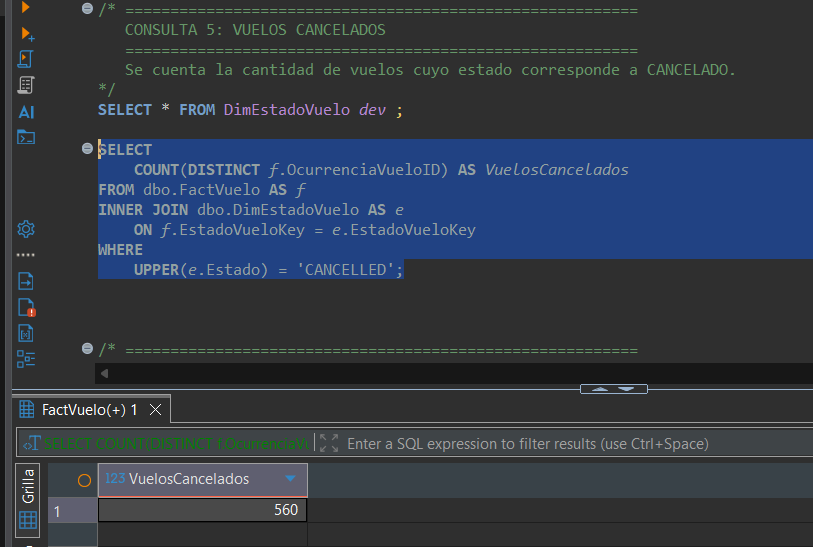
</p>

#### Consulta 6:
<p style="text-align: center;">
  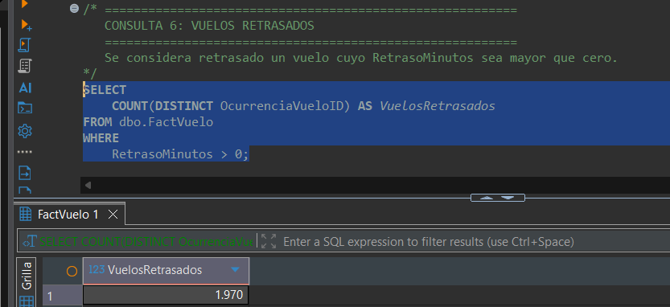
</p>

#### Consulta 7:
<p style="text-align: center;">
  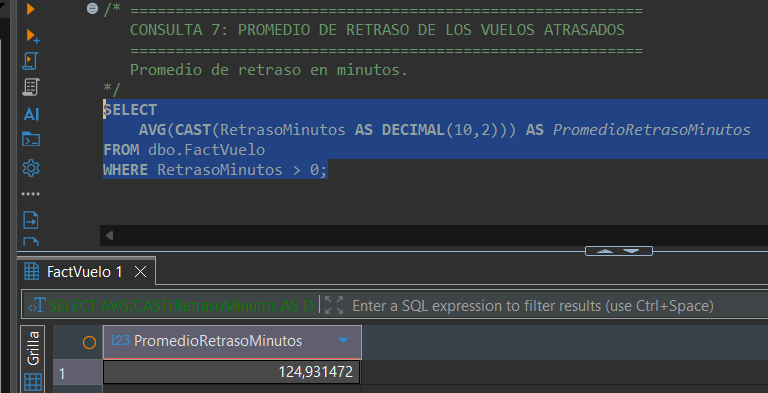
</p>

#### Consulta 8:
<p style="text-align: center;">
  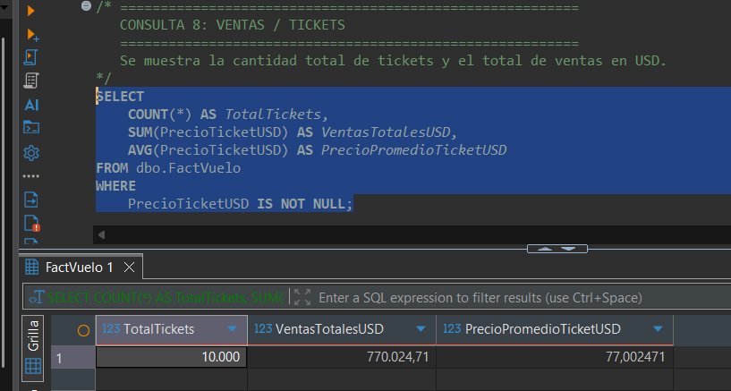
</p>


## Interpretación de los resultados

Después de completar el proceso de transformación, se obtuvo un conjunto de datos más homogéneo y consistente. La estandarización de textos permitió unificar valores escritos con diferentes combinaciones de mayúsculas, minúsculas o espacios innecesarios. También se normalizaron campos como aerolíneas, aeropuertos, género, estados de vuelos, clases de cabina, métodos de pago y monedas. Además, la conversión de fechas, precios y campos numéricos permitió establecer tipos de datos adecuados, mientras que los valores que no pudieron convertirse correctamente fueron tratados como nulos y algunos valores faltantes fueron reemplazados por `UNKNOWN`.

Finalmente, se eliminaron los registros completamente duplicados y se verificó la cantidad de registros antes y después de la transformación. En conjunto, estas operaciones permitieron obtener un dataset más uniforme y preparado para su carga en el Data Warehouse, conservando los registros cuando no era posible determinar un valor y evitando introducir información no comprobada. Esto contribuye a que las consultas analíticas sobre vuelos, aerolíneas, destinos, género, estados, retrasos y ventas produzcan resultados más consistentes y confiables.


## Conclusiones

1. La implementación del proceso ETL permitió transformar y estandarizar los datos de vuelos antes de almacenarlos en el Data Warehouse. La limpieza de textos, fechas, valores numéricos, precios, valores nulos y registros duplicados contribuyó a obtener información más consistente y adecuada para su posterior análisis.

2. El uso del modelo estrella permitió organizar la información de manera clara, separando las características descriptivas en dimensiones y los datos medibles en la tabla `FactVuelo`. Esta estructura facilita la ejecución de consultas analíticas y permite analizar los vuelos desde diferentes perspectivas, como aerolíneas, destinos, pasajeros, fechas, estados y ventas.

3. La implementación de una dimensión de cambio lento Tipo 2 en `DimPasajero` permitió conservar el historial de los cambios en la información de los pasajeros sin perder los valores anteriores. Esto mejora la trazabilidad de los datos y permite que los análisis históricos representen de manera más precisa la información correspondiente al momento en que ocurrió cada vuelo.
