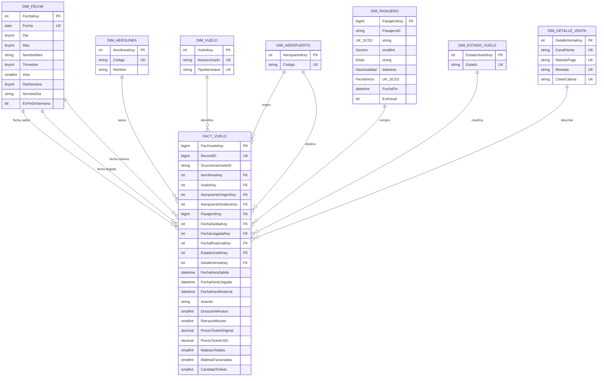

# Modelo multidimensional de vuelos

## Diagrama estrella

## Grano y decisiones de diseño

El grano de `FactVuelo` es **una fila del archivo fuente: un pasajero/ticket en una ocurrencia de vuelo**. `RecordID` es la clave de negocio de la fila y permite repetir la carga sin duplicar hechos.

`OcurrenciaVueloID` identifica la combinación aerolínea, número de vuelo y fecha/hora de salida. Por ello:

- total de tickets o registros: `SUM(CantidadTickets)`;
- total de vuelos físicos: `COUNT(DISTINCT OcurrenciaVueloID)`;
- ventas comparables entre monedas: `SUM(PrecioTicketUSD)`.

`DimFecha` es una dimensión de roles: las tres claves del hecho apuntan a la misma tabla para analizar salida, llegada o reserva. `DimAeropuerto` también desempeña dos roles, origen y destino.

`DimDetalleVenta` agrupa atributos de baja cardinalidad de la transacción. `Asiento` y `RecordID` permanecen como dimensiones degeneradas en el hecho.

## DimPasajero Tipo 2

La clave natural es `PasajeroID`, mientras que `PasajeroKey` identifica cada versión. Un cambio en género, edad o nacionalidad:

1. cierra la versión anterior asignando `FechaFin` y `EsActual = 0`;
2. inserta una nueva versión con otro `PasajeroKey`;
3. enlaza el hecho con la versión vigente en la fecha de reserva (o, si falta, en la fecha de salida).

El índice filtrado `UX_DimPasajero_Actual` garantiza que solo exista una versión actual por pasajero. En el dataset entregado los 10,000 identificadores de pasajero son distintos; la lógica SCD2 queda preparada para cargas futuras donde un identificador reaparezca con cambios.

## Integridad e idempotencia

Todas las relaciones tienen claves foráneas. Cada dimensión posee un miembro con clave `0` para representar valores desconocidos sin dejar claves foráneas nulas. Las restricciones `CHECK` impiden edades, tiempos, precios y cantidades de equipaje inválidas.

La carga usa una tabla temporal, actualiza hechos ya existentes e inserta solo los `RecordID` nuevos. Antes de confirmar la transacción comprueba que todos los registros preparados existan en `FactVuelo`. Ante cualquier error se revierte tanto la carga dimensional como la tabla de hechos.
