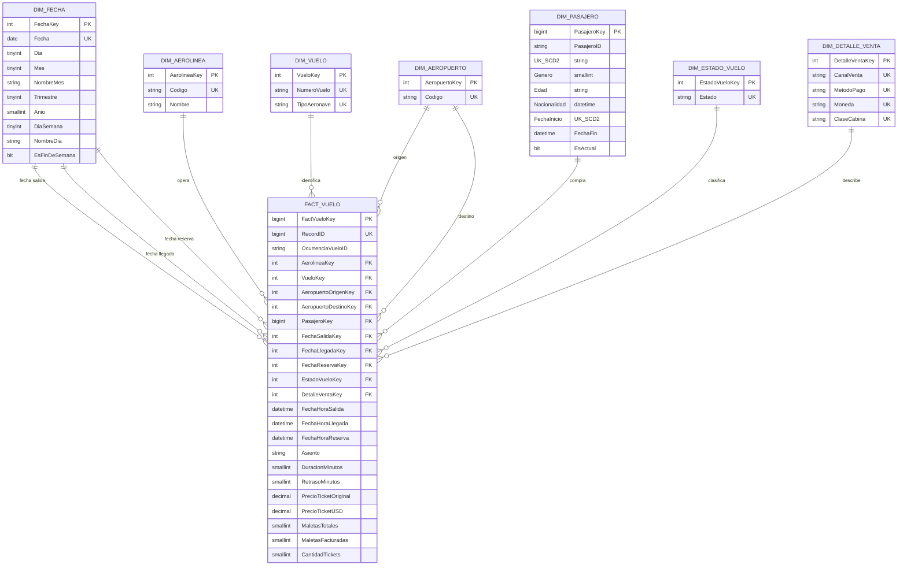

# Práctica 1: Proceso ETL y Modelo Multidimensional de Inteligencia de Negocios (Vuelos)

| Nombre | Carnet |
|--------|--------|
| Gerson David Otoniel González Morales | 202000774 |
| Fernando Misael Morales Ortiz | 202001950 |
| María Cecilia Cotzajay López | 201602659 |

---

## 1. Descripción del Problema y Alcance General

Las organizaciones aeronáuticas actuales generan volúmenes masivos de datos provenientes de registros de vuelos, reservas y transacciones de pasajeros. Para transformar esta información en un activo estratégico, se requiere un proceso estructurado de integración y análisis.

En esta práctica se diseñó e implementó un pipeline **ETL (Extracción, Transformación y Carga)** en Python y un **Modelo Multidimensional** en Microsoft SQL Server. El modelo soporta consultas analíticas de inteligencia de negocios e incorpora manejo de dimensión de cambios lentos **Tipo 2 (SCD2)** para los pasajeros.

---

## 2. Descripción General del Proceso ETL

El proceso ETL está modularizado en la carpeta `src/`:

- **Extracción (`src/extract.py`):** Carga del dataset heterogéneo (`datos/dataset_vuelos_crudo.csv`) utilizando Pandas, aplicando manejo de excepciones para controlar errores de lectura.
- **Transformación (`src/transform.py`):**
  1. *Textos y Códigos:* Estandarización de espacios, conversión de códigos IATA de aerolíneas (`airline_code`) y aeropuertos (`origin_airport`, `destination_airport`) a mayúsculas.
  2. *Homologación de Género:* Mapeo de `MASCULINO`/`MALE` a `M` y `FEMENINO`/`FEMALE` a `F`.
  3. *Fechas:* Parseo multiformato para fechas de salida, llegada y reserva (`%d/%m/%Y %H:%M`, `%m-%d-%Y %I:%M %p`, `%Y-%m-%d %H:%M:%S`).
  4. *Limpieza Numérica y Monetaria:* Eliminación de caracteres especiales en precios, estandarización decimal y conversión a USD.
  5. *Valores Nulos y Duplicados:* Imputación de etiquetas predeterminadas (`UNKNOWN`) en campos faltantes y eliminación de registros idénticos.
- **Carga (`src/load.py` / `src/main.py`):** Carga idempotente hacia la base de datos `VuelosDW` en SQL Server mediante tablas temporales y transacciones para garantizar la integridad referencial.

---

## 3. Modelo Multidimensional (`docs/diagrama_modelo.md`)

El modelo dimensional sigue un diseño en **Estrella** centrado en la tabla de hechos `FACT_VUELO`:



### 3.1 Grano y Tablas
- **Grano de `FACT_VUELO`:** Cada fila corresponde a un ticket/pasajero en una ocurrencia de vuelo.
- **OcurrenciaVueloID:** Agrupa la combinación de aerolínea, número de vuelo y fecha de salida para calcular la cantidad de vuelos físicos (`COUNT(DISTINCT OcurrenciaVueloID)`).
- **Dimensiones de Roles:**
  - `DIM_FECHA`: Se utiliza en tres roles (Salida, Llegada, Reserva).
  - `DIM_AEROPUERTO`: Se utiliza en dos roles (Origen y Destino).
- **Dimensión Tipo 2 (`DIM_PASAJERO`):** Mantiene el historial de cambios mediante la clave natural `PasajeroID`, la clave surrogada `PasajeroKey`, y las columnas `FechaInicio`, `FechaFin` y `EsActual`.

---

## 4. Consultas Analíticas (`sql/consultas.sql`)

Se desarrollaron las siguientes consultas SQL analíticas para la validación del modelo:

1. **Total de Vuelos Físicos:**
   ```sql
   SELECT COUNT(DISTINCT OcurrenciaVueloID) AS TotalVuelos FROM dbo.FactVuelo;
   ```
2. **Vuelos por Aerolínea:**
   ```sql
   SELECT a.Codigo AS CodigoAerolinea, a.Nombre AS Aerolinea, COUNT(DISTINCT f.OcurrenciaVueloID) AS TotalVuelos
   FROM dbo.FactVuelo AS f
   INNER JOIN dbo.DimAerolinea AS a ON f.AerolineaKey = a.AerolineaKey
   GROUP BY a.Codigo, a.Nombre
   ORDER BY TotalVuelos DESC;
   ```
3. **Top 5 Aeropuertos Destino:**
   ```sql
   SELECT TOP 5 ap.Codigo AS AeropuertoDestino, COUNT(DISTINCT f.OcurrenciaVueloID) AS TotalVuelos
   FROM dbo.FactVuelo AS f
   INNER JOIN dbo.DimAeropuerto AS ap ON f.AeropuertoDestinoKey = ap.AeropuertoKey
   GROUP BY ap.Codigo
   ORDER BY TotalVuelos DESC;
   ```
4. **Distribución de Pasajeros por Género:**
   ```sql
   SELECT p.Genero, COUNT(*) AS TotalPasajeros
   FROM dbo.FactVuelo AS f
   INNER JOIN dbo.DimPasajero AS p ON f.PasajeroKey = p.PasajeroKey
   GROUP BY p.Genero
   ORDER BY TotalPasajeros DESC;
   ```
5. **Métricas de Venta y Retrasos:**
   - Promedio de retrasos en minutos.
   - Conteo de vuelos cancelados y retrasados.
   - Total de tickets y ventas consolidadas en USD (`SUM(PrecioTicketUSD)`).

---

## 5. Pasos de Ejecución

### Ejecución con Docker Compose (Recomendado)
```bash
# Iniciar SQL Server y la aplicación ETL
docker compose up -d

# Revisar logs del contenedor ETL
docker compose logs etl
```

### Conexión a la Base de Datos
- **Servidor:** `localhost,1433`
- **Base de Datos:** `VuelosDW`
- **Usuario:** `sa`
- **Contraseña:** `Practica1_G6_2026!`

---

## 6. Estructura del Proyecto

```
Practica1/
├── .env.example
├── Dockerfile
├── docker-compose.yml
├── requirements.txt
├── datos/
│   ├── dataset_vuelos_crudo.csv
│   └── dataset_vuelos_limpio.csv
├── docs/
│   ├── diagrama_modelo.md
│   └── docker.md
├── sql/
│   ├── create_database.sql
│   └── consultas.sql
├── src/
│   ├── extract.py
│   ├── transform.py
│   ├── load.py
│   └── main.py
├── README.md
└── documentacion.md
```
