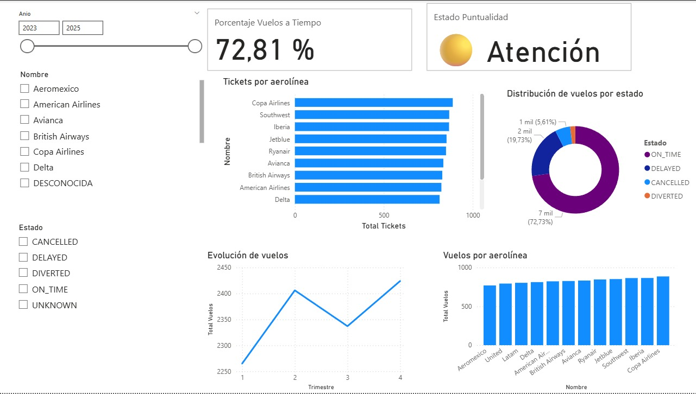

# Práctica 2 — Dashboard y KPIs de Vuelos con Power BI

## Descripción

La presente práctica consiste en la creación de un dashboard analítico utilizando **Power BI**, conectado al Data Warehouse `VuelosDW` desarrollado durante la Práctica 1.

El propósito es aprovechar los datos almacenados en el modelo de vuelos para obtener información más clara y fácil de interpretar sobre el comportamiento de los vuelos, las aerolíneas, los diferentes estados de los vuelos y su puntualidad. Para esto, se construyó un modelo tabular con las relaciones entre la tabla de hechos y sus dimensiones, además de utilizar medidas DAX para realizar los cálculos necesarios y generar visualizaciones interactivas.

El dashboard incluye indicadores clave de desempeño (KPI), gráficos para comparar la información, un análisis de la evolución de los vuelos a través del tiempo y filtros que permiten consultar los datos de acuerdo con diferentes criterios.

---
## Objetivo

El objetivo de esta práctica es desarrollar un dashboard interactivo en Power BI conectado al Data Warehouse `VuelosDW`. A partir de los datos de vuelos se busca facilitar su análisis mediante un modelo tabular, relaciones entre las tablas, una jerarquía de fechas y diferentes medidas creadas con DAX.

#### Objetivos específicos

* Conectar Power BI Desktop con la base de datos `VuelosDW` de SQL Server.
* Utilizar el modelo dimensional desarrollado durante la Práctica 1 como base para el modelo de Power BI.
* Establecer las relaciones necesarias entre la tabla de hechos y las diferentes dimensiones.
* Utilizar una jerarquía de fechas para analizar los vuelos a lo largo del tiempo.
* Crear medidas DAX para analizar la cantidad de vuelos, tickets y duración promedio.
* Crear un KPI que permita evaluar el porcentaje de vuelos realizados a tiempo.
* Diseñar visualizaciones que permitan interpretar los datos de una manera sencilla.
* Incorporar filtros para consultar la información por año, aerolínea y estado del vuelo.

---
## Herramientas utilizadas

Para el desarrollo de la práctica se utilizaron las siguientes herramientas:

* **Power BI Desktop:** utilizado para crear el modelo tabular, las medidas DAX y el dashboard.
* **Microsoft SQL Server:** utilizado para almacenar el Data Warehouse.
* **DAX (Data Analysis Expressions):** utilizado para crear las medidas e indicadores necesarios para el análisis.
* **GitHub:** utilizado para almacenar y documentar el proyecto.

La fuente de datos utilizada es el Data Warehouse `VuelosDW`, desarrollado previamente en la Práctica 1 para almacenar y analizar información relacionada con vuelos.

---
### Estructura de la práctica

```text
Practica2/
├── README.md
├── Dashboard_P2.pbix
└── img/
    ├── diagrama_1.png
    └── diagrama_2.png
```
---
## Conexión con el Data Warehouse

Para realizar el análisis, Power BI se conectó directamente a la base de datos `VuelosDW` almacenada en Microsoft SQL Server.

A partir de esta conexión se cargaron las tablas necesarias para construir el modelo utilizado en el dashboard. De esta manera, se aprovechó la estructura del Data Warehouse creada durante la Práctica 1, evitando tener que trabajar directamente con los datos originales.

---
## Modelo tabular

El modelo utilizado en Power BI sigue una estructura dimensional tipo `estrella`. En el centro se encuentra `FactVuelo`, que contiene los registros relacionados con los vuelos, mientras que las tablas dimensionales aportan la información necesaria para analizar esos registros desde diferentes perspectivas.

### Tabla de hechos

**FactVuelo**

La tabla `FactVuelo` contiene los registros asociados a las ocurrencias de vuelos y tickets. Entre los principales campos utilizados se encuentran:

* `FactVueloKey`
* `RecordID`
* `OcurrenciaVueloID`
* `AerolineaKey`
* `VueloKey`
* `AeropuertoOrigenKey`
* `AeropuertoDestinoKey`
* `PasajeroKey`
* `FechaSalidaKey`
* `FechaLlegadaKey`
* `FechaReservaKey`
* `EstadoVueloKey`
* `DetalleVentaKey`
* `DuracionMinutos`
* `RetrasoMinutos`
* `PrecioTicketOriginal`
* `PrecioTicketUSD`
* `MaletasTotales`
* `MaletasFacturadas`
* `CantidadTickets`

Esta tabla concentra las claves que permiten relacionar los registros con las diferentes dimensiones, además de los datos numéricos utilizados para realizar los cálculos y análisis.

### Tablas dimensionales

El modelo utiliza las siguientes dimensiones:

| Dimensión         | Propósito                                                                               |
| ----------------- | --------------------------------------------------------------------------------------- |
| `DimFecha`        | Permite analizar los vuelos según las fechas de salida, llegada y reserva.              |
| `DimAerolinea`    | Contiene la información de las aerolíneas.                                              |
| `DimAeropuerto`   | Contiene los códigos de los aeropuertos utilizados como origen y destino.               |
| `DimPasajero`     | Contiene información descriptiva de los pasajeros y conserva sus cambios históricos.    |
| `DimVuelo`        | Contiene información como el número de vuelo y el tipo de aeronave.                     |
| `DimEstadoVuelo`  | Permite clasificar los vuelos según su estado.                                          |
| `DimDetalleVenta` | Contiene información sobre el canal de venta, método de pago, moneda y clase de cabina. |

### Relaciones del modelo

Las relaciones del modelo se establecen a partir de las claves de `FactVuelo` y las claves correspondientes de cada dimensión:

* `FactVuelo.AerolineaKey` → `DimAerolinea.AerolineaKey`
* `FactVuelo.VueloKey` → `DimVuelo.VueloKey`
* `FactVuelo.AeropuertoOrigenKey` → `DimAeropuerto.AeropuertoKey`
* `FactVuelo.AeropuertoDestinoKey` → `DimAeropuerto.AeropuertoKey`
* `FactVuelo.PasajeroKey` → `DimPasajero.PasajeroKey`
* `FactVuelo.FechaSalidaKey` → `DimFecha.FechaKey`
* `FactVuelo.FechaLlegadaKey` → `DimFecha.FechaKey`
* `FactVuelo.FechaReservaKey` → `DimFecha.FechaKey`
* `FactVuelo.EstadoVueloKey` → `DimEstadoVuelo.EstadoVueloKey`
* `FactVuelo.DetalleVentaKey` → `DimDetalleVenta.DetalleVentaKey`

Esta estructura permite consultar los datos de `FactVuelo` utilizando la información descriptiva de las diferentes dimensiones.

### Imagen del modelo

<p style="text-align: center;">
  
</p>

---
## Jerarquía temporal

La dimensión `DimFecha` contiene los campos necesarios para analizar la información a través del tiempo.

Para las visualizaciones se utilizó la siguiente jerarquía:

**Año → Trimestre → Mes → Día**

Los campos utilizados son:

* `Anio`
* `Trimestre`
* `Mes`
* `NombreMes`
* `Dia`

El campo `NombreMes` se ordena utilizando el número de mes (`Mes`) para que los meses aparezcan en el orden cronológico correcto.

Esta jerarquía permite comenzar el análisis desde una vista general por año y posteriormente profundizar hasta llegar a períodos más específicos.

---
## Medidas DAX

Las medidas DAX se crearon sobre `FactVuelo` para realizar los principales cálculos utilizados en las visualizaciones y en los indicadores del dashboard.

### Total Vuelos

```DAX
Total Vuelos =
DISTINCTCOUNT(FactVuelo[VueloKey])
```

Esta medida calcula la cantidad de vuelos diferentes registrados. Se utiliza `DISTINCTCOUNT` para contar las claves de vuelo sin repetirlas dentro del contexto del análisis.

La medida se utiliza principalmente en las visualizaciones relacionadas con vuelos por aerolínea, estado y evolución temporal.

### Total Tickets

```DAX
Total Tickets =
SUM(FactVuelo[CantidadTickets])
```

Esta medida obtiene la cantidad total de tickets registrados mediante la suma del campo `CantidadTickets`.

Se utiliza principalmente para comparar el volumen de tickets entre las diferentes aerolíneas.

### Duración Promedio

```DAX
Duracion Promedio =
AVERAGE(FactVuelo[DuracionMinutos])
```

Calcula la duración promedio de los vuelos en minutos.

Esta medida permite complementar el análisis de cantidad de vuelos con información sobre la duración de las operaciones y se actualiza de acuerdo con los filtros aplicados.

### Vuelos a Tiempo

```DAX
Vuelos a Tiempo =
CALCULATE(
    [Total Vuelos],
    REMOVEFILTERS(DimEstadoVuelo[Estado]),
    DimEstadoVuelo[Estado] = "ON_TIME"
)
```

Esta medida calcula la cantidad de vuelos que se encuentran en estado `ON_TIME`.

Se utiliza `REMOVEFILTERS` para quitar primero el filtro aplicado sobre el estado del vuelo y posteriormente establecer `ON_TIME`. De esta manera, el cálculo no se ve afectado cuando se interactúa con el filtro de estado.

### Total Vuelos KPI

```DAX
Total Vuelos KPI =
CALCULATE(
    [Total Vuelos],
    REMOVEFILTERS(DimEstadoVuelo[Estado])
)
```

Esta medida obtiene el total de vuelos utilizado como referencia para calcular el porcentaje de puntualidad.

Se elimina el filtro de estado para que el cálculo represente el total de vuelos independientemente del estado seleccionado.

### Porcentaje Vuelos a Tiempo

```DAX
Porcentaje Vuelos a Tiempo =
DIVIDE(
    [Vuelos a Tiempo],
    [Total Vuelos KPI],
    0
)
```

Esta medida calcula el porcentaje de vuelos realizados a tiempo, tomando como referencia los vuelos en estado `ON_TIME` y el total de vuelos.

Se utiliza `DIVIDE` para evitar problemas cuando el denominador sea cero.

El resultado mostrado actualmente en el dashboard es de aproximadamente **72.81 %**.

### Estado Puntualidad

```DAX
Estado Puntualidad =
SWITCH(
    TRUE(),
    [Porcentaje Vuelos a Tiempo] >= 0.80, "🟢 Bueno",
    [Porcentaje Vuelos a Tiempo] >= 0.60, "🟡 Atención",
    "🔴 Crítico"
)
```

Esta medida clasifica el porcentaje de puntualidad en tres niveles:

| Porcentaje de vuelos a tiempo | Estado      |
| ----------------------------- | ----------- |
| ≥ 80 %                        | 🟢 Bueno    |
| ≥ 60 % y < 80 %               | 🟡 Atención |
| < 60 %                        | 🔴 Crítico  |

Con el resultado actual de **72.81 %**, el indicador se encuentra en el nivel **🟡 Atención**.

---
## Dashboard

El dashboard reúne los principales indicadores y visualizaciones en un solo espacio, con el objetivo de facilitar la consulta y el análisis de la información.

### Indicadores KPI

Se incluyeron dos indicadores principales:

* **Porcentaje de vuelos a tiempo:** 72.81 %
* **Estado de puntualidad:** 🟡 Atención

Estos indicadores permiten conocer rápidamente el nivel de puntualidad y verificar si el resultado se encuentra dentro de los niveles establecidos.

El KPI mantiene los filtros correspondientes al año y la aerolínea, mientras que el filtro de estado no modifica el cálculo del porcentaje de puntualidad.

### Vista general del dashboard

<p style="text-align: center;">
  
</p>

---
## Visualizaciones

### Vuelos por aerolínea

Se utiliza un gráfico de columnas para comparar la cantidad de vuelos registrados por cada aerolínea.

* **Eje:** `DimAerolinea[Nombre]`
* **Valor:** `[Total Vuelos]`

Esta visualización permite identificar qué aerolíneas presentan un mayor o menor volumen de vuelos.

### Tickets por aerolínea

Se utiliza un gráfico de barras horizontales para comparar la cantidad de tickets correspondientes a cada aerolínea.

* **Categoría:** `DimAerolinea[Nombre]`
* **Valor:** `[Total Tickets]`

Esta información permite observar cómo se distribuye el volumen de tickets entre las aerolíneas.

### Distribución de vuelos por estado

Para representar la distribución de los vuelos según su estado se utiliza un gráfico de dona.

* **Leyenda:** `DimEstadoVuelo[Estado]`
* **Valores:** `[Total Vuelos]`

Los estados considerados son:

* `ON_TIME`
* `DELAYED`
* `CANCELLED`
* `DIVERTED`

El gráfico permite observar de manera rápida cómo se distribuyen los vuelos entre los diferentes estados.

### Evolución de vuelos en el tiempo

Se utiliza un gráfico de líneas para observar cómo cambia la cantidad de vuelos a través del tiempo.

La visualización utiliza la jerarquía:

**Año → Trimestre → Mes → Día**

El valor utilizado es `[Total Vuelos]`.

Esto permite observar el comportamiento general de los vuelos y profundizar en períodos específicos cuando sea necesario.

---
## Filtros e interactividad

El dashboard cuenta con tres filtros principales:

* **Año**
* **Aerolínea**
* **Estado del vuelo**

Estos filtros permiten consultar la información de acuerdo con diferentes criterios y actualizar las visualizaciones de forma interactiva.

Por ejemplo, se puede seleccionar un año y una aerolínea para analizar únicamente los vuelos correspondientes a ese período y empresa.

La interacción entre los filtros, indicadores y gráficos facilita la exploración de los datos sin necesidad de modificar manualmente la información almacenada en la base de datos.

---
## Interpretación de resultados

El dashboard permite obtener una visión general del comportamiento de los vuelos a partir de diferentes indicadores y visualizaciones.

Uno de los principales indicadores es el porcentaje de vuelos realizados a tiempo. Actualmente se obtiene un resultado de **72.81 %**, que de acuerdo con los rangos definidos se clasifica como **🟡 Atención**.

Esto significa que el resultado se encuentra por debajo del objetivo establecido del 80 %, por lo que existe una oportunidad de mejorar el nivel de puntualidad.

Los gráficos por aerolínea permiten comparar el volumen de vuelos y tickets, mientras que la distribución por estado ayuda a identificar cómo se comportan los vuelos según si fueron realizados a tiempo, retrasados, cancelados o desviados.

El análisis temporal también permite observar cambios en la cantidad de vuelos y detectar períodos en los que el volumen de operaciones presenta variaciones.

---
## Relevancia estratégica

La información presentada en el dashboard puede utilizarse como apoyo para analizar el comportamiento de las operaciones y facilitar la toma de decisiones.

Entre los principales usos se encuentran:

* Identificar las aerolíneas con mayor volumen de operaciones.
* Comparar la cantidad de vuelos y tickets entre aerolíneas.
* Dar seguimiento al porcentaje de vuelos realizados a tiempo.
* Identificar períodos con cambios en el volumen de vuelos.
* Analizar la distribución de vuelos según su estado.
* Detectar situaciones que puedan requerir atención cuando la puntualidad se encuentra por debajo del objetivo.

El uso de filtros permite realizar estos análisis de forma más específica, dependiendo del año, aerolínea o estado que se quiera revisar.

---
## Decisiones de diseño

Para presentar la información se utilizaron diferentes tipos de visualizaciones, seleccionando cada una según el tipo de análisis que se desea realizar:

* **Tarjetas:** utilizadas para mostrar los principales KPI de forma rápida.
* **Gráfico de columnas:** utilizado para comparar vuelos entre aerolíneas.
* **Gráfico de barras:** utilizado para comparar tickets entre aerolíneas.
* **Gráfico de dona:** utilizado para mostrar la distribución de vuelos por estado.
* **Gráfico de líneas:** utilizado para analizar la evolución de los vuelos a través del tiempo.
* **Slicers:** utilizados para permitir la segmentación interactiva de la información.

La combinación de estos elementos permite presentar los resultados de manera resumida y, al mismo tiempo, facilita profundizar en los datos mediante los filtros y la jerarquía temporal.

---
## Conclusiones

El desarrollo de esta práctica permitió utilizar el Data Warehouse creado en la Práctica 1 para construir un dashboard analítico en Power BI.

A través del modelo tabular, las relaciones entre las tablas, las medidas DAX y las diferentes visualizaciones, fue posible transformar los datos almacenados en información más fácil de consultar e interpretar.

El KPI de puntualidad permite identificar rápidamente el nivel de desempeño de los vuelos, mientras que los gráficos y filtros ofrecen diferentes formas de analizar la información por aerolínea, estado y período de tiempo.

En conjunto, el dashboard proporciona una herramienta que facilita la exploración de los datos y puede servir como apoyo para identificar tendencias, comparar resultados y detectar aspectos que requieran atención.