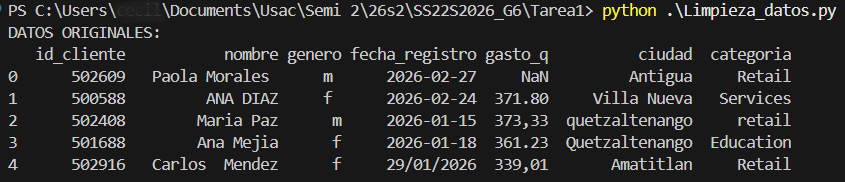
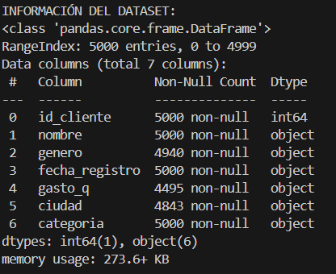
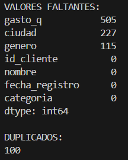
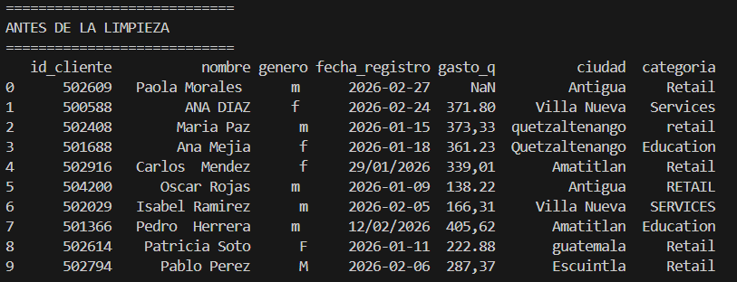
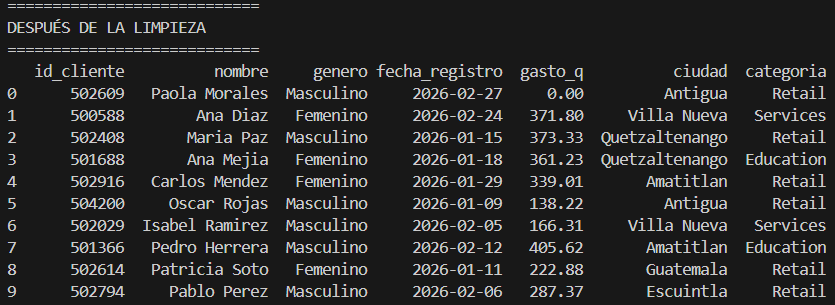
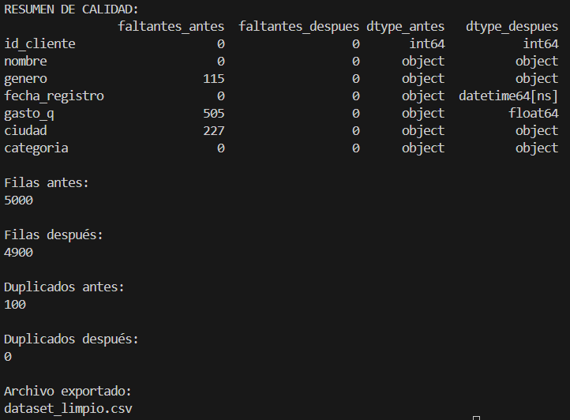

# Tarea 1: Limpieza y análisis inicial de datos con Python y Pandas

## Nombre del dataset

Para esta actividad se utilizó el archivo `dataset_sucio.csv`, el cual contiene 5,000 registros de clientes. Entre sus variables se encuentran el identificador y nombre del cliente, género, fecha de registro, gasto en quetzales, ciudad y categoría.

## Objetivo

Preparar y mejorar la calidad del dataset mediante Python y la biblioteca Pandas, aplicando técnicas de diagnóstico, tratamiento de valores faltantes, estandarización de datos y eliminación de registros duplicados. El resultado del proceso se almacena en el archivo `dataset_limpio.csv`.

## Descripción del proceso de limpieza aplicado

Antes de modificar los datos se realizó un diagnóstico inicial. Para ello, se generó una copia del dataset original y se revisaron su estructura, tipos de datos, valores faltantes y registros duplicados. Esto permitió conservar los datos de entrada para posteriormente compararlos con el resultado depurado.

El proceso de limpieza incluyó las siguientes operaciones:

1. **Estandarización de textos:** se eliminaron los espacios ubicados al inicio y al final de los valores, y las secuencias de varios espacios se reemplazaron por uno solo. Además, los nombres de clientes, ciudades y categorías se convirtieron a formato de título para corregir diferencias entre mayúsculas y minúsculas. Por ejemplo, `CARLOS  MENDEZ` se transforma en `Carlos Mendez` y `quetzaltenango` en `Quetzaltenango`.

2. **Estandarización del género:** se eliminaron espacios innecesarios, los valores se convirtieron temporalmente a mayúsculas y las abreviaturas `M` y `F` fueron reemplazadas por `Masculino` y `Femenino`, respectivamente.

3. **Estandarización de fechas:** debido a que la fecha de registro aparecía en distintos formatos, se reconocieron las variantes `AAAA-MM-DD`, `DD/MM/AAAA` y `AAAA/MM/DD`. Después, los valores válidos se convirtieron al tipo de fecha utilizado por Pandas, obteniendo una representación uniforme al exportar el resultado.

4. **Normalización de valores monetarios:** la columna de gasto fue convertida a un formato numérico. Las comas utilizadas como separador decimal se sustituyeron por puntos y se eliminaron caracteres que no correspondían a números, signo negativo o punto decimal. Los valores que no pudieron convertirse se trataron como datos faltantes.

5. **Tratamiento de celdas vacías:** los nombres y géneros faltantes se completaron con `Desconocido`, mientras que las ciudades y categorías vacías se reemplazaron con `Desconocida`. En la columna de gasto, los valores faltantes se sustituyeron por `0`, bajo el supuesto de que el cliente no registró gastos.

6. **Eliminación de duplicados:** se eliminaron las filas completamente repetidas mediante `drop_duplicates()`. El dataset original contenía 100 registros duplicados; después de esta operación no quedó ningún duplicado y el total se redujo de 5,000 a 4,900 filas.

7. **Validación y exportación:** finalmente, se compararon los valores faltantes, tipos de datos, cantidad de filas y duplicados antes y después del tratamiento. El dataframe depurado se exportó como `dataset_limpio.csv`, sin incluir una columna adicional de índice y utilizando codificación UTF-8.

## Evidencia del proceso y capturas

En la pantalla principal se puede apreciar las primeras filas de nuestro dataset sin analizar, aparecen valores nulos, nombres con letras mayúsculas entre palabras, distintos formatos de fechas al igual que en la columna gasto.

  

Además se muestra información relevante del dataset que se analizará, cuenta con 5000 filas y 7 columnas, sus encabezados y la cantidad de datos no nulos que poseen cada una.

  

En esta sección se puede ver a mayor detalle la cantidad de datos nulos que presenta cada columna siendo la de Gasto con 505 valores, en total se cuenta con 100 valores duplicados a lo largo de todo el dataset.

  

Demos una ultima vista del dataset antes de la limpieza, esta vez mostrando mas datos para ver su estado.

  

En este resultado ya se puede ver los datos con mayor claridad, mas ordenados, todos poseen un mismo formato, los nombres con su primer letra en mayúscula, fecha en un solo formato, gasto en decimales utilizando el punto.

  

Por último en esta sección se tiene más detallado el proceso de limpieza se puede observar que a cada columna se muestra la cantidad de datos faltantes que tenia antes de la limpieza y la cantidad despues es 0 en cada una, asi como la conversion de tipos de datos segun corresponde a cada una.
Se eliminaron los datos duplicados y por ultiom el nombre del archivo al cual fue exportado el dataset limpio.

  

## Resumen de resultados

| Indicador | Antes de la limpieza | Después de la limpieza |
|---|---:|---:|
| Cantidad de registros | 5,000 | 4,900 |
| Registros duplicados | 100 | 0 |
| Formatos de texto | Inconsistentes | Estandarizados |
| Formatos de fecha | Diferentes formatos | Formato uniforme |
| Valores de gasto | Texto, comas decimales y vacíos | Valores numéricos y vacíos sustituidos por 0 |

## Interpretación de los resultados

Después de completar todo el proceso, se pudo observar la importancia de mantener la homogeneidad de los datos, procurando que todos posean un mismo formato y tipo de dato, además de encontrarse completos, es decir, sin valores nulos y sobre todo sin registros repetidos.

El proceso de limpieza de datos es fundamental, ya que permite transformar la información en un conjunto de datos más estructurado y manejable. Esto facilita su utilización en procesos posteriores y contribuye a obtener resultados más precisos y confiables.

En el dataset utilizado se determinó que el nombre del cliente no representaba una variable relevante para el análisis realizado, por lo que se lleno con valor establecido por el analista.  

## Archivos Utilizados

- `Limpieza_datos.py`: script que realiza el diagnóstico, la limpieza, la comparación y la exportación.
- `dataset_sucio.csv`: dataset original utilizado como entrada.
- `dataset_limpio.csv`: dataset generado después del proceso de limpieza.
