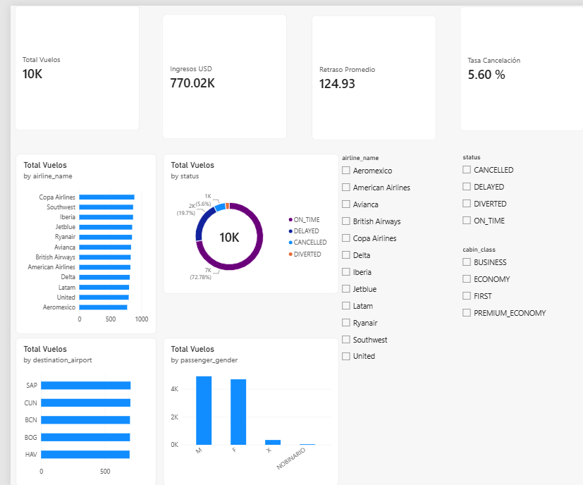

# Tarea 2 - Dashboard analítico en Power BI

**Carnet:** 202000774

## Descripción

La tarea consiste en crear un dashboard analítico en Power BI utilizando un dataset de vuelos. El objetivo es presentar indicadores relacionados con los estados de los vuelos, aerolíneas, destinos, retrasos e ingresos.

El dataset contiene 10,000 registros y 26 columnas con información de vuelos, aeropuertos, pasajeros, fechas, precios, ventas y equipaje.

## Dataset

El archivo CSV fue importado mediante Power Query. Cada fila representa un registro de vuelo dentro del conjunto de datos.

## Transformaciones

En Power Query se realizaron las siguientes acciones:

1. Importación del archivo CSV.
2. Promoción de la primera fila como encabezados.
3. Revisión y asignación de tipos de datos.
4. Conversión de los campos numéricos utilizados en los indicadores.
5. Creación de la columna `FechaSalida` a partir de `departure_datetime`.
6. Manejo de los diferentes formatos presentes en las fechas.
7. Conservación de valores nulos cuando el dato no aplica, como llegada, duración o asiento en vuelos cancelados.

La información se cargó en una tabla llamada `FactVuelos`. El dashboard utiliza esta tabla consolidada para construir las medidas y visualizaciones.

## Indicadores

### Total de vuelos

```DAX
Total Vuelos =
DISTINCTCOUNT(FactVuelos[record_id])
```

**Resultado:** 10,000 vuelos.

### Ingresos en USD

```DAX
Ingresos USD =
SUM(FactVuelos[ticket_price_usd_est])
```

**Resultado:** USD 770,024.71.

### Vuelos cancelados

```DAX
Vuelos Cancelados =
CALCULATE(
    [Total Vuelos],
    FactVuelos[status] = "CANCELLED"
)
```

**Resultado:** 560 vuelos.

### Tasa de cancelación

```DAX
Tasa Cancelación =
DIVIDE(
    [Vuelos Cancelados],
    [Total Vuelos],
    0
)
```

**Resultado:** 5.60 %.

### Vuelos retrasados

```DAX
Vuelos Retrasados =
CALCULATE(
    [Total Vuelos],
    FactVuelos[status] = "DELAYED"
)
```

**Resultado:** 1,970 vuelos.

### Retraso promedio

```DAX
Retraso Promedio =
CALCULATE(
    AVERAGE(FactVuelos[delay_min]),
    FactVuelos[status] = "DELAYED"
)
```

**Resultado:** aproximadamente 124.93 minutos entre los vuelos retrasados.

## Visualizaciones

El dashboard incluye:

- Tarjetas con total de vuelos, ingresos, tasa de cancelación y retraso promedio.
- Gráfico comparativo de vuelos por aerolínea.
- Distribución de vuelos por estado.
- Gráfico con los cinco destinos principales.
- Distribución por género.
- Segmentadores por aerolínea, estado y clase de cabina.

## Captura del dashboard



## Incidente al guardar el archivo de Power BI

Se intentó guardar el tablero como `Dashboard_202000774.pbix`. Durante el proceso el archivo fue generado, pero al verificarlo apareció con un tamaño de 0 bytes, por lo que no quedó como un archivo válido que pudiera abrirse nuevamente en Power BI.

La siguiente captura muestra la evidencia del archivo generado con 0 bytes:


Debido a este inconveniente se conservó la captura del dashboard como evidencia de que el tablero sí fue construido y visualizado antes de intentar guardarlo.

## Interpretación

La mayoría de los vuelos se encuentra en estado `ON_TIME`, con 7,278 registros, equivalentes al 72.78 % del total. Los vuelos retrasados representan el 19.70 %, los cancelados el 5.60 % y los desviados el 1.92 %.

Los vuelos retrasados presentan un promedio aproximado de 124.93 minutos. Esto indica que, aunque la mayor parte de las operaciones se realiza a tiempo, los retrasos registrados pueden ser considerables.

Los destinos con mayor cantidad de registros son SAP, CUN, BOG, BCN y HAV. Los indicadores y segmentadores permiten comparar estos resultados por aerolínea, estado y clase de cabina.

## Archivos

- `dashboard_202000774.png`: captura del dashboard construido.
- `dashboard_202000774.pbx.png`: evidencia del archivo de Power BI generado con 0 bytes.
- `README_202000774.md`: documentación.

