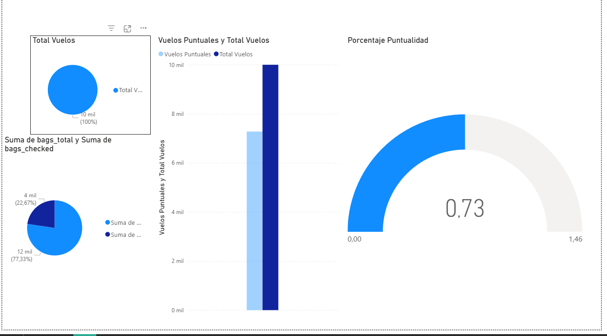

# Tarea 2 - Construcción de Dashboard Analítico en Power BI

## Descripción

El presente proyecto consiste en la construcción de un dashboard analítico en Power BI a partir de un dataset de vuelos.

El conjunto de datos utilizado contiene **10,000 registros y 26 columnas**, con información relacionada con aerolíneas, vuelos, aeropuertos, pasajeros, reservas, precios y equipaje.

Entre los principales campos utilizados para el análisis se encuentran:

- Aerolínea.
- Número de vuelo.
- Aeropuerto de origen y destino.
- Fecha y hora de salida.
- Fecha y hora de llegada.
- Estado del vuelo.
- Minutos de retraso.
- Duración del vuelo.
- Tipo de aeronave.
- Clase de cabina.
- Información del pasajero.
- Canal de venta.
- Método de pago.
- Precio del boleto.
- Equipaje registrado.

El objetivo del dashboard es presentar de forma visual el comportamiento general de los vuelos, principalmente en aspectos relacionados con la puntualidad, retrasos, cancelaciones y participación de las diferentes aerolíneas.

---

## Dataset utilizado

El archivo utilizado para el análisis fue:

`dataset_vuelos_limpio.csv`

El dataset ya había pasado previamente por un proceso de limpieza y estandarización, por lo que en Power BI se realizaron principalmente verificaciones y ajustes necesarios para su correcta interpretación.

---

## Transformaciones realizadas

El dataset fue importado utilizando **Power Query** de Power BI.

Las principales acciones realizadas fueron:

1. Importación del archivo CSV.
2. Promoción de la primera fila como encabezados.
3. Verificación y asignación de los tipos de datos correspondientes.
4. Configuración de los campos de fecha y hora como valores de tipo fecha/hora.
5. Configuración de campos como duración, retraso, edad y precios como valores numéricos.
6. Verificación de los campos de texto, como aerolínea, estado del vuelo, aeropuertos y clase.
7. Conservación de valores nulos que tienen sentido dentro del contexto de los datos, por ejemplo, información de llegada o duración no disponible en vuelos cancelados.

Después de verificar los datos, la información fue cargada al modelo de Power BI para la creación de medidas e indicadores.

---

## Indicadores utilizados

Para facilitar el análisis se crearon diferentes medidas utilizando DAX.

### Total de vuelos

Cantidad total de registros de vuelos presentes en el dataset.

```DAX
Total Vuelos =
COUNTROWS(Vuelos)
```

**Resultado:** 10,000 vuelos.

### Vuelos puntuales

Cantidad de vuelos cuyo estado es `ON_TIME`.

```DAX
Vuelos Puntuales =
CALCULATE(
    [Total Vuelos],
    Vuelos[status] = "ON_TIME"
)
```

**Resultado:** 7,278 vuelos.

### Porcentaje de puntualidad

Representa el porcentaje de vuelos que llegaron o se realizaron puntualmente respecto al total de vuelos.

```DAX
Porcentaje Puntualidad =
DIVIDE(
    [Vuelos Puntuales],
    [Total Vuelos],
    0
)
```

**Resultado:** 72.78 %.

### Vuelos retrasados

Cantidad de vuelos identificados con estado `DELAYED`.

```DAX
Vuelos Retrasados =
CALCULATE(
    [Total Vuelos],
    Vuelos[status] = "DELAYED"
)
```

**Resultado:** 1,970 vuelos, equivalentes al 19.70 % del total.


**Resultado:** aproximadamente 124.93 minutos.

---

## Visualizaciones del dashboard

Para representar la información de manera clara e interactiva se utilizaron diferentes visualizaciones en Power BI.

### Indicadores principales

Se utilizaron tarjetas para mostrar los principales KPIs del análisis, como:

- Total de vuelos.
- Porcentaje de puntualidad.
- Vuelos cancelados.
- Retraso promedio.

Estas tarjetas permiten conocer rápidamente la situación general del conjunto de vuelos.

### Distribución de vuelos por estado

Se utilizó un **gráfico circular** para representar la distribución de los vuelos según su estado.

La distribución obtenida fue:

| Estado | Cantidad | Porcentaje |
|---|---:|---:|
| ON_TIME | 7,278 | 72.78 % |
| DELAYED | 1,970 | 19.70 % |
| CANCELLED | 560 | 5.60 % |
| DIVERTED | 192 | 1.92 % |
| **Total** | **10,000** | **100 %** |

### Vuelos por aerolínea

Se utilizó un gráfico de barras para comparar la cantidad de vuelos registrados por cada aerolínea.

Esta visualización permite identificar cuáles aerolíneas poseen una mayor participación dentro del conjunto de datos.

### Comparación de retrasos

Se realizó una visualización comparativa para analizar el comportamiento de los retrasos entre las diferentes aerolíneas.

Esto permite identificar diferencias en el desempeño operativo y determinar cuáles presentan mayores tiempos de retraso.

### Segmentadores

El dashboard incluye segmentadores que permiten filtrar de forma interactiva la información presentada.

Entre los filtros utilizados se encuentran:

- Aerolínea.
- Estado del vuelo.
- Aeropuerto de origen.

Los filtros actualizan automáticamente las gráficas y los indicadores del dashboard.

---

## Captura del dashboard



---

## Interpretación de resultados

A partir del dashboard se puede observar que la mayoría de los vuelos registrados presentan un comportamiento puntual. De los 10,000 vuelos analizados, **7,278 se encuentran clasificados como puntuales**, lo cual representa un **72.78 % del total**.

Por otra parte, **1,970 vuelos presentan retrasos**, equivalentes al **19.70 %**. Esto significa que aproximadamente uno de cada cinco vuelos del conjunto de datos tuvo algún tipo de retraso.

Los vuelos cancelados representan una proporción menor, con **560 registros o 5.60 % del total**, mientras que los vuelos desviados representan **192 registros o 1.92 %**.

Otro indicador importante es el tiempo promedio de retraso. Entre los vuelos clasificados como retrasados se obtuvo un promedio aproximado de **124.93 minutos**, equivalente a poco más de dos horas. Esto muestra que, aunque la mayoría de los vuelos se desarrolla de manera puntual, cuando ocurre un retraso este puede ser considerable.

La comparación entre aerolíneas permite complementar estos indicadores generales y analizar cuáles concentran una mayor cantidad de vuelos y cómo se comportan respecto a los retrasos.

En general, el dashboard facilita la interpretación de los datos al combinar indicadores, gráficas y filtros interactivos, permitiendo analizar rápidamente el comportamiento operativo de los vuelos desde diferentes perspectivas.

---


